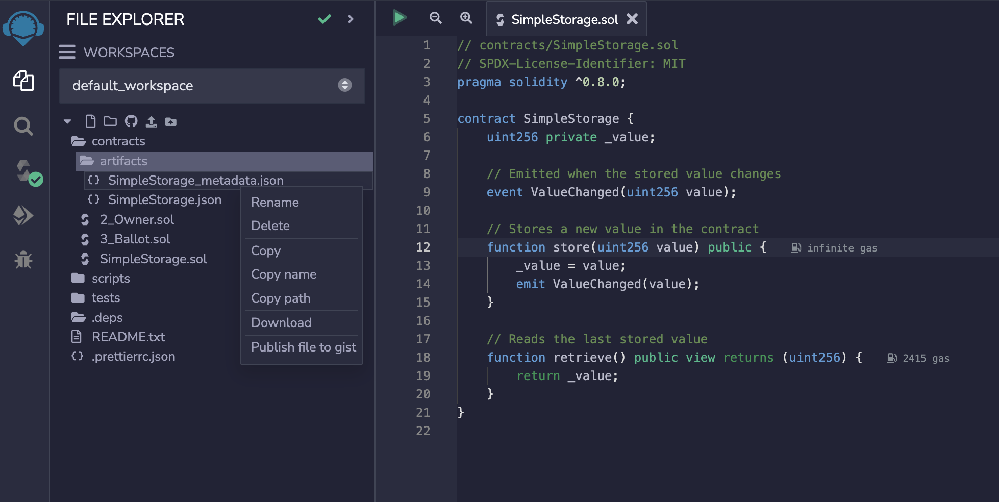
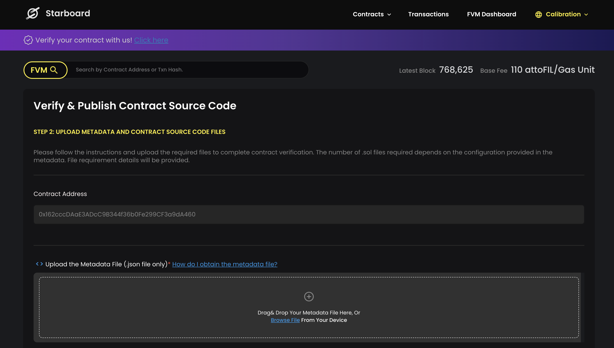

### Installation

1. Install dependencies

```bash
yarn install
```

2. Add hardhat-verify package

```bash
yarn add @starboardventures/hardhat-verify`
```

3. Import and use package

```bash
import "@starboardventures/hardhat-verify
```

### Contract Verification Methods

1. [Manually via Starboard FVM explorer UI](#method-1-manually-via-starboard-fvm-explorer-ui)
2. [Via Starboard API](#method-2-via-api)
3. [Hardhat plugin - cli](#method-3-hardhat-plugin-cli)
4. [Hardhat plugin - script](#method-4-hardhat-plugin-script)

### Method 1: Manually via Starboard FVM explorer UI

1. Deploy contract on remix and download metadata json file
   
2. Visit https://fvm.starboard.ventures/explorer/verifier
   
3. Upload metadata json file and contracts
   

### Method 2: Via API

Refer to docs: https://fvm.starboard.ventures/contract/verify/api-docs


### Method 3: Hardhat plugin (cli)

Refer to package Readme: https://www.npmjs.com/package/@starboardventures/hardhat-verify

1. Deploy

```bash
npx hardhat run scripts/deploy.ts --network <network>
# Testnet: npx hardhat run scripts/deploy.ts --network calibrationnet
# Mainnet: npx hardhat run scripts/deploy.ts --network FilecoinMainnet
```


2. Verify via CLI

```bash
npx hardhat starboard-verify <CONTRACT_NAME> <CONTRACT_ADDRESS>
# e.g: npx hardhat starboard-verify Token 0xb3b5a2021dD3a4251A8528c71
```

3. Generate Metadata

```bash
npx hardhat starboard-verify <CONTRACT_NAME> metadata
# e.g: npx hardhat starboard-verify Token metadata
```

### Method 4: Hardhat plugin (script)

Running the deploy-verify script:

```bash
npx hardhat run scripts/deploy.ts --network <network>
# Testnet: npx hardhat run scripts/deploy-and-verify.ts --network calibrationnet
# Mainnet: npx hardhat run scripts/deploy-and-verify.ts --network FilecoinMainnet
```
