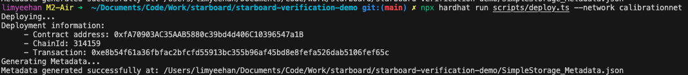

### Installation

1. Install dependencies

```bash
yarn install
```

2. Add

```bash
yarn add @starboardventures/hardhat-verify`
```

3. add import

```bash
import "@starboardventures/hardhat-verify
```

### Compilation and deployment

1. Compile. `artifacts`, `cache`, `typechain-types` will be generated

```bash
npx hardhat compile
```

### Method 1: Hardhat plugin (cli)

1. Deploy

```bash
npx hardhat run scripts/deploy.ts --network <network>
# Testnet: npx hardhat run scripts/deploy.ts --network calibrationnet
# Mainnet: npx hardhat run scripts/deploy.ts --network FilecoinMainnet
```



2. Verify via CLI

```bash
npx hardhat starboard-verify <CONTRACT_NAME> <CONTRACT_ADDRESS>
# e.g: npx hardhat starboard-verify Token 0xb3b5a2021dD3a4251A8528c71
```

3. Generate Metadata

```bash
npx hardhat starboard-verify <CONTRACT_NAME> metadata
# e.g: npx hardhat starboard-verify Token metadata
```

### Method 2: Hardhat plugin (script)

Running the deploy-verify script:

```bash
npx hardhat run scripts/deploy.ts --network <network>
# Testnet: npx hardhat run scripts/deploy-and-verify.ts --network calibrationnet
# Mainnet: npx hardhat run scripts/deploy-and-verify.ts --network FilecoinMainnet
```

### Method 3: FVM API

1. Deploy

```bash
npx hardhat run scripts/deploy.ts --network <network>
# Testnet: npx hardhat run scripts/deploy.ts --network calibrationnet
# Mainnet: npx hardhat run scripts/deploy.ts --network FilecoinMainnet
```

2. Generate `POST`` request

```bash
curl --request POST 'https://fvm-calibration-api.starboard.ventures/api/v1/contract/${YourContractAddress}/verify'
--form 'metadata.json=@"artifacts/contracts/Box.sol/Box.json"'
--form 'Box.sol=@"contrats/Box.sol"'
--form 'hardhat/console.sol=@"node_modules/hardhat/console.sol"'
# --form '@openzeppelin/contracts/token/ERC721/ERC721.sol=@"path/@openzeppelin/contracts/token/ERC721/ERC721.sol"'
```
