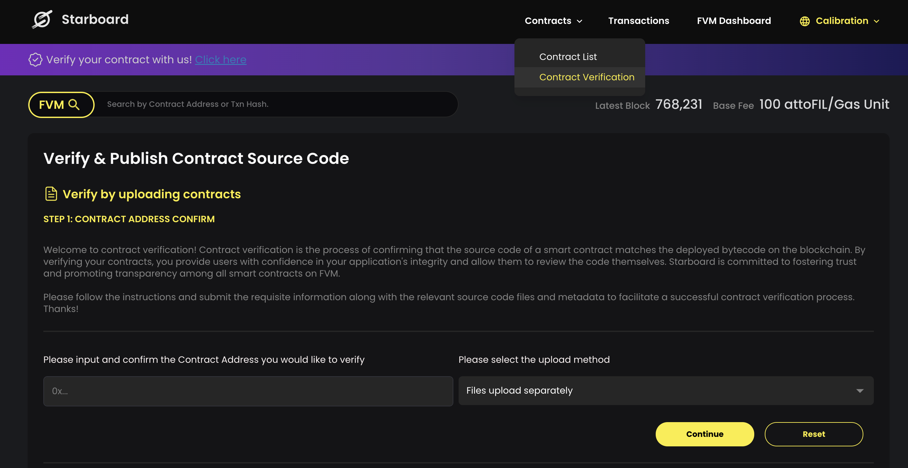
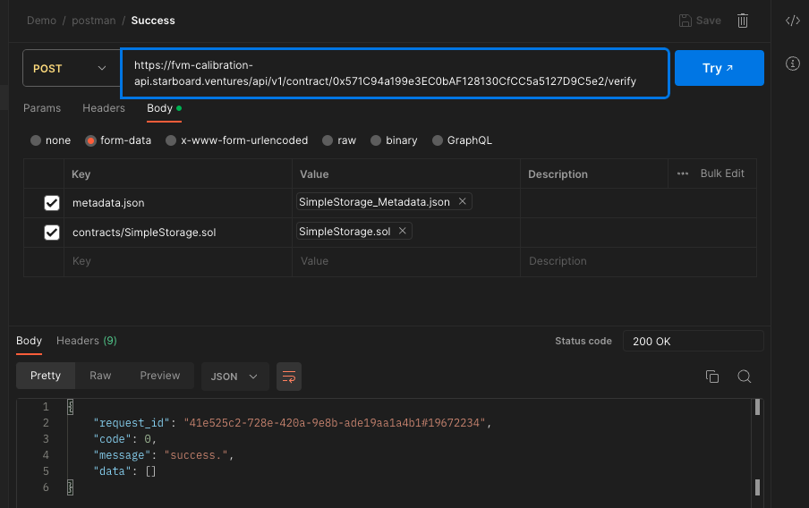
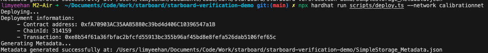

### Installation

1. Install dependencies

```bash
yarn install
```

2. Add hardhat-verify package

```bash
yarn add @starboardventures/hardhat-verify`
```

3. Import and use package

```bash
import "@starboardventures/hardhat-verify
```

### Method 1: Manually via Starboard FVM explorer UI



### Method 2: Via API

Refer to docs: https://fvm.starboard.ventures/contract/verify/api-docs



### Method 3: Hardhat plugin (cli)

1. Deploy

```bash
npx hardhat run scripts/deploy.ts --network <network>
# Testnet: npx hardhat run scripts/deploy.ts --network calibrationnet
# Mainnet: npx hardhat run scripts/deploy.ts --network FilecoinMainnet
```



2. Verify via CLI

```bash
npx hardhat starboard-verify <CONTRACT_NAME> <CONTRACT_ADDRESS>
# e.g: npx hardhat starboard-verify Token 0xb3b5a2021dD3a4251A8528c71
```

3. Generate Metadata

```bash
npx hardhat starboard-verify <CONTRACT_NAME> metadata
# e.g: npx hardhat starboard-verify Token metadata
```

### Method 4: Hardhat plugin (script)

Running the deploy-verify script:

```bash
npx hardhat run scripts/deploy.ts --network <network>
# Testnet: npx hardhat run scripts/deploy-and-verify.ts --network calibrationnet
# Mainnet: npx hardhat run scripts/deploy-and-verify.ts --network FilecoinMainnet
```
